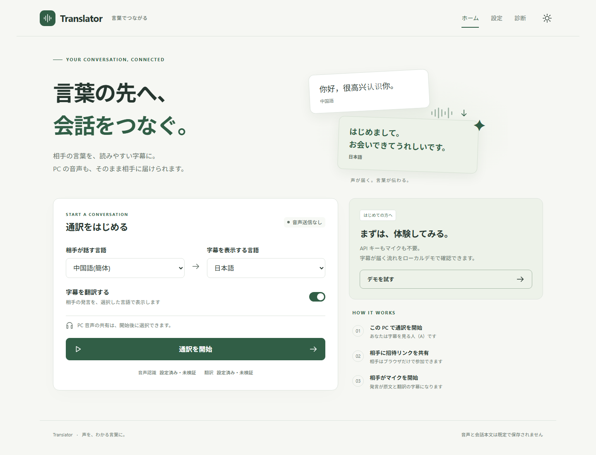

# Translator

**相手の言葉を字幕で読む。自分のPCの音声を相手へ送る。**

主な操作者は **AIエージェント** です。字幕を見る人（A）のWindows PCで、エージェントがCLIから起動・設定・会話・招待・停止を管理します。話す人（B）は招待リンクからブラウザで参加します。Bの音声を文字起こし・翻訳してA/B画面に表示し、Aが開始したPC音声共有をBで再生します。翻訳の音声合成・双方向の自動音声翻訳は含みません。

現在は **0.2.0プレビュー** です。Windows配布物を作るCIと、実行ファイルの起動試験を備えています。実API・別PCとの遠隔音声・クリーンVMでの試験結果は、[検証記録](docs/verification.md)を確認してください。

## AIエージェントから使う

最初に [AGENTS.md](AGENTS.md) を読み、目的に応じた短い手順へ進んでください。ホストの操作には、画面のクリックではなく `translator agent` の名前付きコマンドを使います。

```sh
uv run --locked translator agent catalog --command runtime-start
```

- [最短手順：独立したデータディレクトリでデモを開始・確認・停止](docs/agents/quickstart.md)
- [操作一覧：設定・実通訳・招待・公開・時間を指定したPC音声共有](docs/agents/operations.md)
- [失敗時の復旧手順](docs/agents/troubleshooting.md) / [コードとテストの対応表](docs/agents/repository-map.md)
- [エージェント文書の索引](docs/agents/index.md) / [機械可読索引](docs/agents/index.json) / [コマンド契約](contracts/agent-interface.json)

`catalog --command` で必要な操作だけを読み、全コマンドの列挙が必要なときだけ `--command` を省略してください。各コマンドはJSONを返します。終了コードと `ok` を確認し、返されたセッションIDを次のコマンドに渡します。ポートやIDを推測せず、同じ `--data-dir` を使ってください。

通常の状態確認には会話本文を返さない `status` を使います。字幕が必要な場合だけ `session-snapshot --limit` で取得件数を指定します（既定10件、最大100件）。Runtimeを起動しただけでは、会話・マイク・PC音声の送信は始まりません。デモは `session-create --mode demo`、実通訳は `--mode live` を明示して選びます。

**新しいエージェントCLIは、現在のソースから利用してください。公開済みの `v0.2.0-preview.1` には、このCLIとエージェント用実行ファイルは含まれていません。** ソースにはuvとNode.js 24/npmが必要です。B側のブラウザ参加とマイク許可は、エージェントのホスト操作とは別に必要です。

## 人がブラウザで操作する場合

以下は既存の人向けガイドです。React画面からも起動後の設定・字幕表示・診断を操作できます。



## 1. アプリを起動する

Windows x64配布ZIPをすべて展開し、`Translator.exe`を起動します。Python、Node.js、uv、Gitは配布版の実行には不要です。

[Windowsプレビュー版をダウンロード](https://github.com/Rimcat-JA/translator/releases/tag/v0.2.0-preview.1)

配布物は[GitHub Actions](https://github.com/Rimcat-JA/translator/actions)の成功した`Translator checks`実行から、`Translator-windows-x64-preview`アーティファクトを取得できます。ZIP・`SHA256SUMS.txt`・未署名である旨を同梱します。取得にはGitHubへのログインが必要な場合があります。

```powershell
Get-FileHash .\Translator-windows-x64-preview.zip -Algorithm SHA256
```

アプリを開いた段階では、マイク取得・PC音声共有・外部API通信は開始しません。起動済みなら、同じアプリの画面を再表示します。

## 2. 最初の設定

まず「デモを試す」で、APIキー・マイクなしのローカルデモを利用できます。デモは実際の音声認識ではありません。

実通訳では設定画面で音声認識用のGladiaキー、翻訳用のDeepLキーとFree/Pro区分を入力します。キーはOSの資格情報ストア、または利用者が選んだ今回限りのメモリへ保存します。画面には保存状態だけを返します。接続テストはボタンを押したときにだけ実行され、Gladiaでは外部セッションを作るため使用量が発生し得ます。

A側で「通訳を開始」を押し、必要に応じて「PC音声共有」を別途開始します。PC音声には選んだ出力機器で再生する通知音等も含まれます。

## 3. 相手が参加する

同じPCで試すときは招待リンクを別のブラウザ画面で開けます。別PCから参加する場合は設定画面でngrok認証・公開ドメインを設定し、公開を開始してから招待リンクを発行します。転送対象は参加用Hubだけです。

Bは招待リンクを開いて「参加してマイクを開始」を押し、マイクを許可します。招待は10分・1回限りです。Bのマイク送信は1画面だけが取得でき、同時送信を防ぎます。HTTPSが必要で、localhost/loopbackでの同一PC試験は例外です。

- Bのマイク音声 → Gladia（文字起こし）
- 認識したテキスト → DeepL（翻訳がオンで、入力と出力の言語が異なる場合）
- Aが共有を開始したPC音声 → B
- リモート参加の通信 → ngrokを経由

音声と会話本文をディスクへ保存しません。画面用の字幕はメモリに最大100発言を保持し、会話終了時に消去します。

## 開発・ソースからの利用

Python 3.13.13をuvで管理し、Node.js 24系でUIをビルドします。ソース導線はuvとNode.js/npmの導入を前提とします。初回はネットワークが必要です。

```powershell
.\start.cmd
```

```sh
./start.sh
```

仮想環境のactivate・別ターミナル・手動ビルドは不要です。フロントエンド入力とlockfileが変化したときだけ必要なビルドを行い、通常実行時にNode.jsサーバーを常駐させません。

```sh
uv run --locked translator start --demo
uv run --locked translator start --no-browser
uv run --locked translator doctor
uv run --locked translator stop
uv run --locked translator dev
```

`dev`はLocal/Hubと、それぞれを転送するVite（5173/5174）を一緒に起動します。PC音声キャプチャの優先対象はWindows x64です。macOS/Linuxはサーバー・UI開発とデモ用途で、PC音声取得の対応を表示しません。

## テストとWindowsビルド

```sh
uv sync --locked
npm --prefix frontend ci
npm --prefix frontend run typecheck
npm --prefix frontend test
uv run --locked pytest
uv run --locked python tools/build_frontend.py
uv run --locked python tools/smoke_runtime.py
npm --prefix frontend exec playwright install chromium
npm --prefix frontend run test:e2e
```

Windowsで配布物を作る場合:

```sh
uv run --locked pyinstaller --noconfirm packaging/translator.spec
uv run --locked python tools/smoke_runtime.py --exe dist/Translator-windows-x64/Translator.exe
uv run --locked python tools/package_release.py
```

自動テストは有料APIを使いません。Windows実行ファイルの試験ではPATHから開発ツールを外して起動しますが、これは開発ツールをインストールしていないクリーンVM試験とは区別します。

## 困ったとき

- 画面が開かない: `translator doctor`で資産・設定・依存を確認してください。配布版は`Translator.exe doctor`相当の診断を画面から利用できます。
- キーを保存できない: 安全なOS資格情報ストアが利用できない場合は「今回のみ」を選びます。平文ファイルには切り替えません。
- マイクを開始できない: B側のブラウザ許可、入力機器、HTTPS接続、他画面の送信権を確認します。
- 翻訳エラー: 原文は残り、翻訳の失敗が表示されます。キー・Free/Pro区分・利用量を確認してください。
- PC音声が届かない: Aで共有を明示開始し、Bでも音声を有効にしてください。A画面との接続が失われると共有を停止します。
- アプリ終了: 診断画面の終了操作、または`translator stop`。ブラウザを閉じた後もRuntimeは再表示用に残ります。

設定・ログはWindowsでは`%LOCALAPPDATA%\Translator\`です。設定の破損時は元ファイルを退避します。既存`.env`は設定画面で取り込みを選んだときだけ読み、元ファイルは残します。

## 旧版からの変更

旧`server.main:app`の未認証エンドポイントは無効にしています。旧音声CLI・HTMLは移行時の参照として残っていますが、新しいRuntimeには接続できません。旧URLを認証なしで並行公開しないでください。

[実装API](contracts/implementation-api.md) / [アーキテクチャ](docs/architecture.md) / [検証記録](docs/verification.md)
